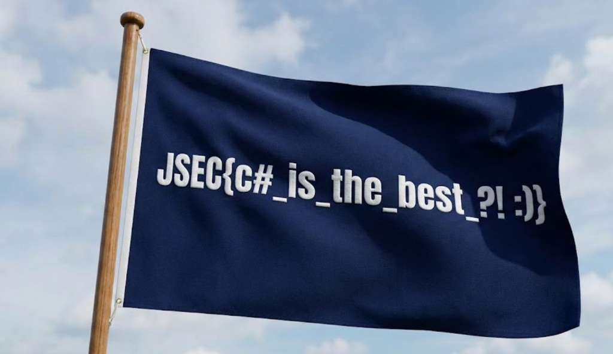

# 🚩 CTF Write-up: The Will (Reverse Engineering)

## 📝 Challenge Description
**Challenge Name:** The Will  
**Category:** Reverse Engineering  
**Platform:** JordanSec CTF  
**Difficulty:** Medium  

> *Description:* "It seems he’s hiding a secret in the depths, but where?"

---

## 🔍 Phase 1: Initial Reconnaissance

The first step was identifying the file type using the `file` command:

```bash
file "The will.exe"
```

**Result:** `PE32 executable for MS Windows, Mono/.Net assembly`.

Since it is a **.NET assembly**, most of the program logic can be recovered using decompilers such as **ILSpy** or **dnSpy**.

---

## 🛠️ Phase 2: Static Analysis & Resource Extraction

Using `monodis`, I inspected the embedded resources inside the executable:

```bash
monodis --manifest "The will.exe"
```

This revealed an encrypted embedded resource:

`public 'The_will.Resources.f1.png.enc' at offset 552`

I then extracted the encrypted data using `dd`:

```bash
dd if="The will.exe" bs=1 skip=552 of=f1.png.enc
```

---

## 🔓 Phase 3: Decryption Strategy

After decompiling the executable with **ILSpy**, I identified the decryption routine used by the application.  
The program uses **AES-CBC** to protect the hidden image.

- **Algorithm:** `AES`
- **Cipher Mode:** `CBC`
- **Key:** `shadowpass123456`
- **IV:** Extracted from the first 16 bytes of the encrypted resource

---

## 🐍 Phase 4: The Solver (Python)

I wrote a Python script to decrypt the embedded file.  
Because the decrypted output contained extra bytes before the actual PNG file, the script searched for the **PNG magic bytes** and carved the image correctly.

```python
from Crypto.Cipher import AES

def solve():
    key = b"shadowpass123456"
    with open("f1.png.enc", "rb") as f:
        data = f.read()

    iv = data[:16]
    encrypted_payload = data[16:]

    cipher = AES.new(key, AES.MODE_CBC, iv)
    decrypted = cipher.decrypt(encrypted_payload)

    png_header = b'\x89PNG\r\n\x1a\n'
    start = decrypted.find(png_header)

    if start != -1:
        with open("flag.png", "wb") as f:
            f.write(decrypted[start:])
        print("[+] Success! Flag saved as flag.png")
    else:
        print("[-] PNG header not found.")

solve()
```

---

## 🖼️ Recovered Evidence

After decrypting and cleaning the output file, the hidden flag was successfully recovered as a PNG image, shown below:


---

## 🏁 Conclusion

By analyzing the .NET metadata, extracting the encrypted resource, and reversing the AES-CBC decryption logic, the hidden image was successfully recovered and the flag was obtained.

---

## 🧰 Tools Used

- **ILSpy / monodis**: .NET decompilation and resource inspection
- **dd**: Data carving
- **Python 3**: Custom decryption script
- **Hex Editor**: File signature verification